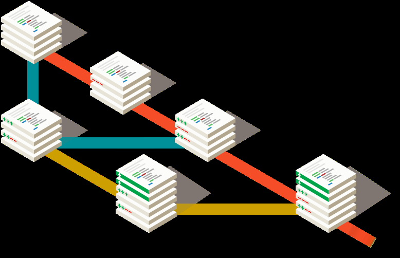
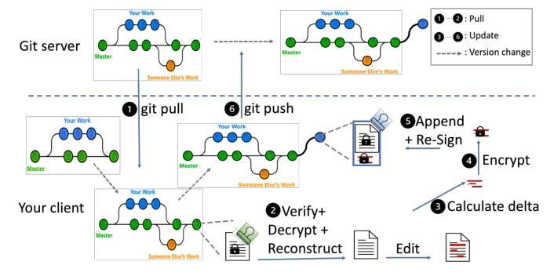
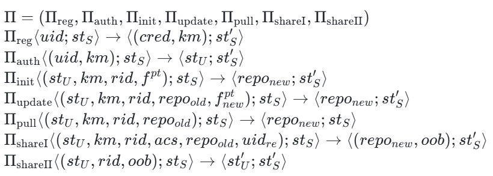
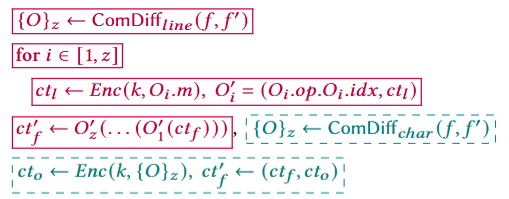
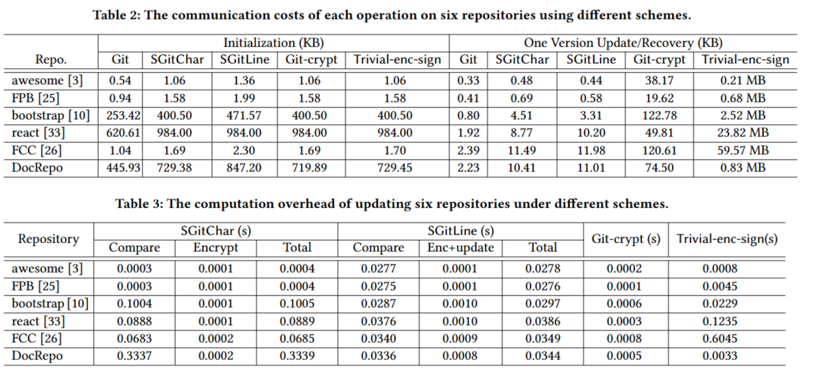
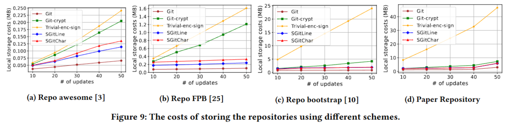

# End-to-End Encrypted Git Services（CCS 2025 演讲笔记）

> 源文件：`Git Services.pdf`（PDF 原文保留，本文由 OCR 识别生成，为幻灯片式笔记整理）
>
> Ya-Nan Li (The University of Sydney), Yaqing Song (UESTC), Qiang Tang (The University of Sydney), Moti Yung (Google & Columbia University). CCS 2025, 20 November 2025.

## 目录

1. **GIT SERVICE** — Introducing the Git service and privacy concerns
2. **GIT CANNOT OFFER E2E SECURE** — Security, Overhead and Platform Compatibility
3. **RESULTS & CONTRIBUTIONS** — Formalizing critical security properties: Confidentiality & Repository unforgeability; Balancing overhead & security
4. **CONSTRUCTION & EXPERIMENTATION** — 2 constructions: SGitLine & SGitChar; Conducting experiments on 6 public repos

## 1 Git Service

### 1.1 What is Git?

Git: Distributed Version Control System

1. Tracks file change records and version rollback as repository, provides branch management capabilities
2. Supports multi-person collaborative development and synchronize to Git

> Git is indispensable in the IT industry

### 1.2 The Rising Demand for E2E Security

Why Existing Git Platforms' Security Mechanisms Are No Longer Sufficient？

1. **Data is visible to the server.** Data in private repositories is also visible to server author A. Git server 上的明文文件（plain file master）对服务器可见。
2. **Access control relies on the server.** Unauthorized modifications in collaboration can affect the final product（unauthorized push 到 master）。

Partially solution: optional verified commit signature, features relies on servers（author B read-only）。

> E2E encryption is needed to ensure Client privacy

## 2 Git Cannot Offer E2E Secure

### 2.1 E2E Encrypted Cloud Storage Can not Replace E2E Git Security Directly

| | Cloud storage（静态数据） | Git（动态更新、协作编辑） |
|---|---|---|
| 1. Functional Mismatch | 只保存最终版本（Only final version） | push/pull 需要云端计算缺失部分，无分支合并（no Branch merging） |
| 2. Security Inadequacy | — | 数据每次更新，对访问控制需求更大 |
| 3. Efficiency Issues | — | 保存完整编辑链导致强计算、通信与存储开销 |

> Git's unique workflow (dynamic updates, collaborative editing) requires a special design

### 2.2 Security risks in existing ad hoc secure Git service designs

On an untrusted server：
1. Not Confidentiality
2. Failed Integrity
3. Lack of Unforgeability

- **Git-crypt & Gringotts**: deterministic encryption, weak protection, vulnerable to injection attacks。Malicious injection 导致 errors(data key) 被协作者后续使用（author A read&write）。
- **git-secret & Keybase**: users choose which file to protect. Entire repository lacks protection. (author B read-only)
- **Unforgeability**: read-write access separation. No party can assume the rights of any user. (illegal push master)

> Need to design a formally analyzed E2E encrypted Git service.

### 2.3 Overhead Challenges in Existing Solutions

**Table 1: Comparison with the state-of-the-art "encrypted" Git services.**

| Schemes | Confidentiality | Integrity | Unforgeability | Storage increase per version | Client enc cost per update | Comm cost per update | Compatibility |
|---------|-----------------|-----------|----------------|------------------------------|----------------------------|----------------------|----------------|
| Git-crypt [4] | ✗ | ✗ | ✗ | $n_f L$ | $n_f L$ | $n_f L$ | ✓ |
| Gringotts [37] | ✗ | ✗ | ✗ | $n_f \ell_1$ | $n_f L$ | $n_f \ell_1$ | ✗ |
| Git-secret [34] | ✓* | ✗ | ✗ | $n_f L$ | $n_f L$ | $n_f L$ | ✓ |
| Git-re-gcrypt [8] | ✓ | ? | ? | $n_f L$ | $n_f L$ | $n_f L$ | ✗ |
| Disac [38] | ✓ | ? | ? | $n_f L$ | $n_f L$ | $n_f L$ | ✓ |
| Keybase-Git [9] | ✓ | ? | ? | $n_f L$ | $n_f L$ | $n_f L$ | ✗ |
| Trivial-enc-sign | ✓ | ✓ | ✓ | $R$ | $R$ | $R$ | ✓ |
| **Our SGitLine** | ✓** | ✓ | ✓ | $n_f \ell_1$ | $n_f \ell_1$ | $n_f \ell_1$ | ✓ |
| **Our SGitChar** | ✓ | ✓ | ✓ | $n_f \ell_2$ | $n_f \ell_2$ | $n_f \ell_2$ | ✓ |

*：安全性有条件（由用户决定加密哪些部分）；**：弱版本的机密性定义；?：无正式安全分析或明显攻击，安全性尚不明确。$n_f$ 表示每个存储库版本中更改文件的数量；$L, R$ 分别表示文件和存储库的（平均）大小；$\ell_1, \ell_2$ 表示每次文件更新时，平均每行更改和每个字符更改的大小。通常 $\ell_2 \ll \ell_1 \ll L$ 且 $n_f L \ll R$。

> Goal: Overhead proportional only to actual edits.

### 2.4 Platform Compatibility: Working with Existing infrastructure

Employ E2E encrypted services by simply installing a new secure Git client.

> Use current Git-provided service operations

## 3 Results & Contributions

### E2E Secure Git Service Challenge

- Identify and formalize critical security properties of an E2E encrypted Git service
- Give provably secure constructions that are both with minimal overhead and platform-compatible with existing Git servers.

### 3.1 Result: 安全属性

Users trust cryptographic methods; 通过密码学手段实现类似可信服务器的理想访问控制（Untrust server + Reliable cryptography）：

1. **Confidentiality**: Party without the permission to access confidential data cannot obtain content and update details;
2. **Repository unforgeability**: Party without write permission cannot forge or impersonate the identity of a legitimate user to write data.

Update details: Operation type (insert/delete), Modification position (line number, character position), Modification length

### 3.2 Result: 构造目标

1. **Dilemma (Overhead vs. Security)**:
   - Encrypting entire files before pushing disables Git's diff calculation, increasing overhead.
   - Line-by-line encryption exposes specific update positions.
2. **Need**: Leverage Git's diff functionality; No changes to Git platform's overall design

### 3.3 Contributions

1. Presenting formal syntax and security models for E2E encrypted Git service, data confidentiality and repository unforgeability.
2. 2 constructions: **SGitLine** (line-wise) and **SGitChar** (char-level, update details-hiding), both compatible with existing Git platforms.
3. Implementation. Conducting experiments on 6 GitHub repos, and showing overhead advantages.

The main workflow of SGit:

## 4 Construction & Experimentation

### 4.1 Syntax & Security Models

**协议形式化**：SGit 由七个交互式协议组成：

$$\Pi = (\Pi_{reg}, \Pi_{auth}, \Pi_{init}, \Pi_{update}, \Pi_{pull}, \Pi_{shareI}, \Pi_{shareII})$$

- $\Pi_{reg}\langle uid; st_S\rangle \rightarrow \langle(cred, km); st_S'\rangle$
- $\Pi_{auth}\langle(uid, km); st_S\rangle \rightarrow \langle st_U; st_S'\rangle$
- $\Pi_{init}\langle(st_U, km, rid, f^{pt}); st_S\rangle \rightarrow \langle repo_{new}; st_S'\rangle$
- $\Pi_{update}\langle(st_U, km, rid, repo_{old}, f_{new}^{pt}); st_S\rangle \rightarrow \langle repo_{new}; st_S'\rangle$
- $\Pi_{pull}\langle(st_U, km, rid, repo_{old}); st_S\rangle \rightarrow \langle repo_{new}; st_S\rangle$
- $\Pi_{shareI}\langle(st_U, km, rid, acs, repo_{old}, uid_{re}); st_S\rangle \rightarrow \langle(repo_{new}, oob); st_S'\rangle$
- $\Pi_{shareII}\langle(st_U, rid, oob); st_S\rangle \rightarrow \langle st_U'; st_S'\rangle$

**Security**：1. setup: PKI, OOB. 2. Data confidentiality 3. Repository unforgeability

### 4.2 SGitLine（行级）

**记号**：

- $K_m = ((sk_s, pk_s), (sk_e, pk_e), mk)$ — Signature, Encryption, Symmetric master key
- $k = KDF(mk, rid)$ — Hybrid encryption
- $\mathsf{Repo} = (f^{ct}, f_{acs}, f_{tag})$
- $f^{ct} = \{ct_1, ct_2, \ldots, ct_n\}$
- $f_{tag} = (uid, \sigma)$: $rh = \mathsf{MerkleDAG}(f^{ct} \| f_{acs})$, $h = \mathsf{Hash}(rid \| uid \| rh)$, $\sigma = \mathsf{Sign}(sk_s, h)$
- $f_{acs} = \{Read_{acs}, Write_{acs}, \sigma_{acs}\}$; $\sigma_{acs} = \mathsf{Sign}(sk_s, Read_{acs} \| Write_{acs})$

**流程**：
1. **Initialization** (reg, auth, init)
2. **Update**: $\{O\}_z \leftarrow \mathsf{ComDiff}_{line}(f, f')$；for $i \in [1, z]$: $ct_l \leftarrow \mathsf{Enc}(k, O_i.m)$, $O_i' = (O_i.op, O_i.idx, ct_l)$；$ct_f' \leftarrow O_z'(\cdots(O_1'(ct_f)))$，用混合加密加密 $\{O\}_z$；计算整个密文仓库的 MerkleDAG 哈希（用于完整性验证），并用 $sk_s$ 签名。
3. **Pull**: 逐行解密（Decrypt line by line）
4. **Share**: $K_{share} \leftarrow \mathsf{encrypt}(repo\ key\ k, pk_{e(receiver)})$; Update $f_{acs}$

**特性**：
- Weak data confidentiality: cannot hide updated position & length
- Storage: correlated with the number of lines.

### 4.3 SGitChar（字符级）

- $\mathsf{ComDiff}_{char}$：更新操作合并为 "difference set" $D$
  - $D = \{(i, type, ci'_{ct}) \mid i \in \mathsf{Index}, type \in \{\mathsf{modify}, \mathsf{add}, \mathsf{delete}\}\}$
- **Data confidentiality**: conceals updated content, location, and operation type.
- **Efficiency**: correlated with the number of characters.
- **Defect**: pulling to a new local repository requires decrypting all historical differences – may occurs when sharing out.

### 4.4 Implementation & Comparison of Overhead

**实现**：Python, pycryptodome library；AES-CTR as enc；ECDSA as sign；SHA-256 as hash；HKDF-SHA-256 as key derivation。

**指标**：Initialize communication (KB) / update·pull communication (KB) / update·pull computation-diff (s) / computation-encrypt (s) / computation-all (s) / Pull (recover) computation (s) / Multi-version store storage (MB)

**Table 2: The communication costs of each operation on six repositories using different schemes.**

| Repo. | Init: Git | Init: SGitChar | Init: SGitLine | Init: Git-crypt | Init: Trivial | Update: Git | Update: SGitChar | Update: SGitLine | Update: Git-crypt | Update: Trivial |
|-------|-----------|----------------|----------------|-----------------|---------------|-------------|------------------|------------------|-------------------|-----------------|
| awesome | 0.54 | 1.06 | 1.36 | 1.06 | 1.06 | 0.33 | 0.48 | 0.44 | 38.17 | 0.21 MB |
| FPB | 0.94 | 1.58 | 1.99 | 1.58 | 1.58 | 0.41 | 0.69 | 0.58 | 19.62 | 0.68 MB |
| bootstrap | 253.42 | 400.50 | 471.57 | 400.50 | 400.50 | 0.80 | 4.51 | 3.31 | 122.78 | 2.52 MB |
| react | 620.61 | 984.00 | 984.00 | 984.00 | 984.00 | 1.92 | 8.77 | 10.20 | 49.81 | 23.82 MB |
| FCC | 1.04 | 1.69 | 2.30 | 1.69 | 1.70 | 2.39 | 11.49 | 11.98 | 120.61 | 59.57 MB |
| DocRepo | 445.93 | 729.38 | 847.20 | 719.89 | 729.45 | 2.23 | 10.41 | 11.01 | 74.50 | 0.83 MB |

**Table 3: The computation overhead of updating six repositories under different schemes.**

| Repository | SGitChar Compare (s) | SGitChar Encrypt (s) | SGitChar Total (s) | SGitLine Compare (s) | SGitLine Enc+update (s) | SGitLine Total (s) | Git-crypt (s) | Trivial-enc-sign (s) |
|------------|----------------------|----------------------|--------------------|----------------------|-------------------------|--------------------|---------------|----------------------|
| awesome | 0.0003 | 0.0001 | 0.0004 | 0.0277 | 0.0001 | 0.0278 | 0.0002 | 0.0008 |
| FPB | 0.0003 | 0.0001 | 0.0004 | 0.0275 | 0.0001 | 0.0276 | 0.0001 | 0.0045 |
| bootstrap | 0.1004 | 0.0001 | 0.1005 | 0.0287 | 0.0010 | 0.0297 | 0.0006 | 0.0229 |
| react | 0.0888 | 0.0001 | 0.0889 | 0.0376 | 0.0010 | 0.0386 | 0.0003 | 0.1235 |
| FCC | 0.0683 | 0.0002 | 0.0685 | 0.0340 | 0.0009 | 0.0349 | 0.0008 | 0.6045 |
| DocRepo | 0.3337 | 0.0002 | 0.3339 | 0.0336 | 0.0008 | 0.0344 | 0.0005 | 0.0033 |

**Figure 9: The costs of storing the repositories using different schemes**（multi-version 存储成本，随更新次数增长：Git < SGitLine/SGitChar << Trivial-enc-sign，Git-crypt 居中）。

**对比结果（awesome 仓库）**：

| Scheme | Initialize communication (KB) | Update communication (KB) | Update time (s) | Pull time (s) |
|--------|------------------------------|---------------------------|-----------------|---------------|
| SGitChar | 1.06 | 0.48 | 0.0004 | 0.0001 |
| SGitLine | 1.36 | 0.44 | 0.0278 | 0.0048 |
| Git-crypt | 1.06 | 38.17 | 0.0002 | 0.0001 |
| Trivial-enc-sign | 1.06 | 210.0 | 0.0008 | 0.0008 |

- **SGitChar**: Excellent Initialize / pull performance, low update communication cost, overall balanced;
- **SGitLine**: Update communication cost is better than SGitChar, but update / pull calculation time is higher;
- **Git-crypt**: Update calculation time is the lowest, but update communication cost is extremely high;
- **Trivial-enc-sign**: The various costs (especially communication) are the highest, and the performance is the worst.

## Conclusion

1. **Conclusion**: First formal, systematic study on E2E encrypted Git services; formalizes core security properties (confidentiality, unforgeability), proposes SGitLine/SGitChar
2. **Open Problems - Security**: Extend models to adaptive corruption; strengthen metadata security (hide access/edit patterns)
3. **Open Problems - Functionality**: Support flexible crypto group management, key rotation, revocation, accountability; integrate with web-based Git interfaces
4. **Future Directions**: Explore post-compromise security, key rotation, group management...
